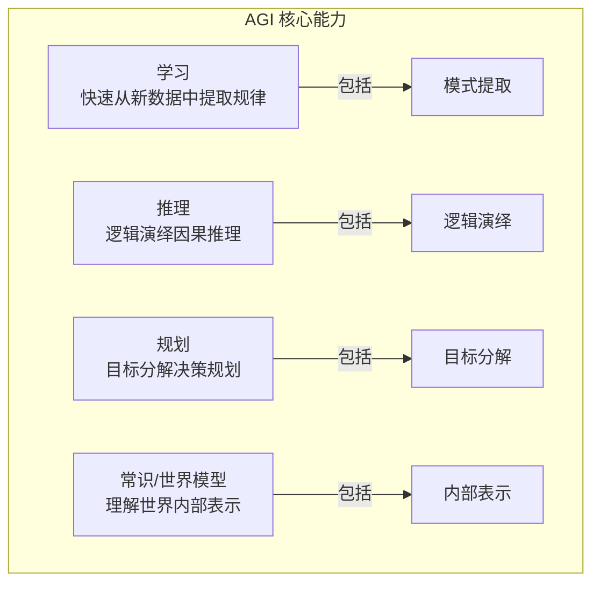
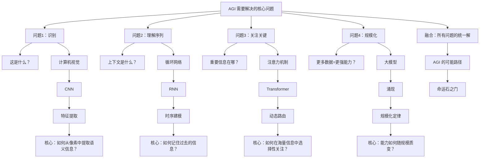
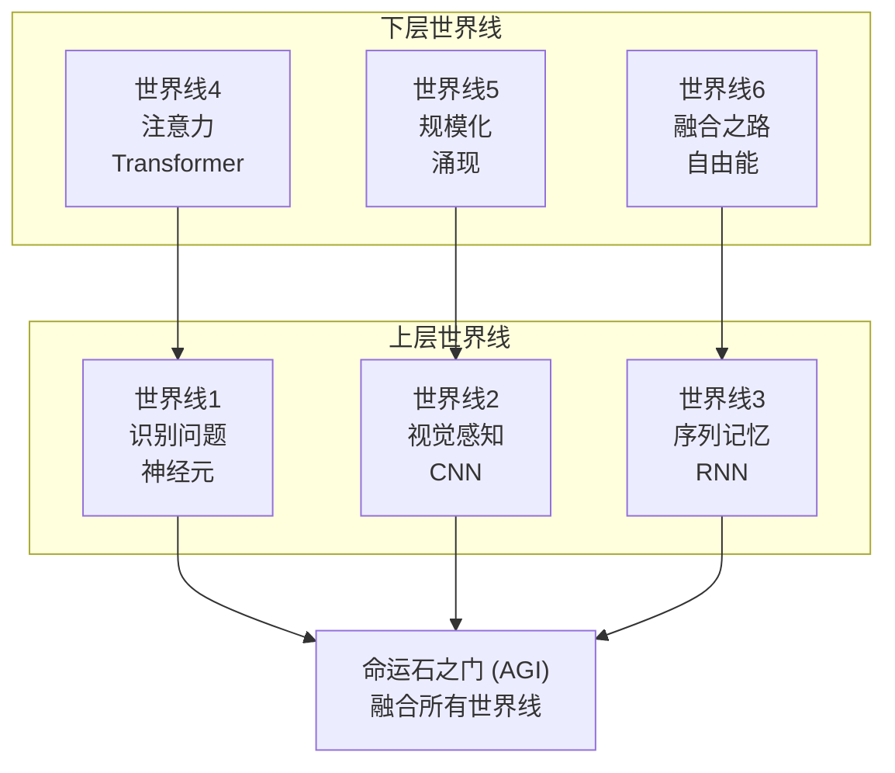

# 第 0 章：目标——构建 AGI

> *"在开始旅程之前，我们需要知道目的地在哪里。"*
>
> —— 红莉栖

::: tip 故事背景
本课程以《命运石之门》的世界观为隐喻，带领你从零开始探索通用人工智能（AGI）的奥秘。每条世界线代表一个核心问题的解决方案，最终汇聚于「命运石之门」—— AGI 的终极形态。

> *"一切都是命运石之门的选择。"*
>
> —— 冈部伦太郎
:::

---

## 0.0 在学习之前

在开始这段探索之旅之前，我们需要先建立正确的学习观念。技术学习不仅仅是记住知识点，更重要的是培养解决实际问题的能力。

### 0.0.1 讲义信息框说明

讲义中会出现一些信息框，根据其颜色和左上角的图标可以得知信息的类别：

::: note 提示
一般性的提示信息，帮助你更好地理解内容。
:::

::: info 相关说明
提供与当前内容相关的补充信息和背景知识。
:::

::: tip 扩展阅读
推荐的相关资料、论文或链接，供你深入学习。
:::

::: warning 注意事项
学习过程中需要特别注意的事项，避免踩坑。
:::

::: caution 警告
重要警示信息，违反可能导致学习失败或产生错误理解。
:::

::: important 重要任务
本章需要完成的学习任务或思考题，必须认真对待。
:::

> 数学相关的知识点会使用以下格式呈现，方便你快速定位和复习：

::: info 数学知识
**核心概念：** 这里会讲解与当前内容相关的数学知识。

**公式：**
$$
f(x) = \dots
$$

**几何直觉：** 用直观的方式理解抽象的数学概念。
:::

### 0.0.2 提问的智慧

::: important 阅读"提问的智慧"文档

在继续学习之前，请先阅读以下文档：

- [提问的智慧（GitHub 版本）](https://github.com/ryanhanwu/How-To-Ask-Questions-The-Smart-Way/blob/main/README-zh_CN.md)
- [提问的智慧（一生一芯版）](https://fa45epzd9c7.feishu.cn/docx/KMnFdHMgIozXL5xGmHHcpuU8nre)

:::

阅读"提问的智慧"并不只是为了浪费时间，而是为了让大家知道"怎么提问是正确的"。当你愿意为这些正确的做法去努力，并且尝试用专业的方式提出问题的时候，你就已经迈出了成为专业人士的第一步。

### 0.0.3 大佬三连：STFW, RTFM, RTFSC

::: important 理解 STFW, RTFM, RTFSC 的含义

尝试在上述文章中寻找并理解这三个缩写的含义。

**常见含义：**

- **STFW** - Search The Friendly Web（善用搜索引擎）
- **RTFM** - Read The Friendly Manual（阅读手册）
- **RTFSC** - Read The Friendly Source Code（阅读源代码）

:::

你可能会觉得字母 F 冒犯了你，但事实上这个字母的含义从来都不是重点，它只是反映出这三个缩写背后的传奇色彩而更容易被大家记住而已。RTFSC 起源于 Linux 之父 Linus Torvalds 在 1991 年 4 月 1 日回复邮件中的第一句话，目前在网上还能搜到当时的邮件列表。

### 0.0.4 学会独立解决问题

很多同学都会抱有这样的观点：

> 我向大佬请教，大佬告诉我答案，我就学习了。

但你是否想过，将来你进入公司，你的领导让你尝试一个技术方案；或者是将来你进入学校的课题组，你的导师让你探索一个新课题。你可能会觉得：到时候身边肯定有厉害的同事，或者有师兄师姐来带我。但实际情况是，同事也要完成他的 KPI，师兄师姐也要做他们自己的课题，没有人愿意被你一天到晚追着询问。

**独立解决问题的能力是可以训练出来的。**

你身边的大佬之所以成为了大佬，是因为他们比你更早地锻炼出独立解决问题的能力。当你还在向他们请教一个很傻的问题的时候，他们早就解决过无数个奇葩问题了。事实上，你的能力是跟你独立解决问题的投入成正比的。

::: important 端正学习心态
记住：**你来参加学习，你就应该尽自己最大努力独立解决遇到的所有问题**。
:::

### 0.0.5 学习建议

学习是一项需要科学方法的系统工程，其核心目标不是简单地记忆知识，而是真正掌握解决问题的技能。正如实践所证明的，只有当我们能够将所学知识应用到实际问题中时，真正的学习才得以发生。

为了实现这一目标，我们应当优先选择主动学习方式（如实践操作、知识输出和问题解决），而非被动接收信息（如单纯听课、阅读）。主动参与学习过程能显著提高我们对知识的理解和应用能力。

构建系统化的知识体系是将知识转化为技能的重要基础。通过绘制知识地图，我们可以梳理知识点之间的内在联系，建立结构化的认知框架，并将新知识与已有经验有机融合。

::: note 学习建议
记住：学习的目标不是记住知识，而是掌握技能，真正的学习发生在你能够运用知识解决实际问题的时候。
:::

---

## 0.1 什么是 AGI？

**定义：**
> 通用人工智能（Artificial General Intelligence，简称 AGI），
> 能够像人类一样完成任何智力任务的 AI。

### 0.1.1 当前 AI 的局限

尽管现代 AI 在特定任务上已经超越了人类（如图像分类、围棋、蛋白质结构预测），但与人类智能相比，仍然存在根本性的局限：

| 局限 | 表现 | AGI 需要什么 |
|------|------|-------------|
| **任务专用** | 一个模型只能做一件事 | 任务无关的通用能力 |
| **缺乏理解** | 表面模式匹配，缺乏真正的语义理解 | 真正的语义理解与常识推理 |
| **无常识** | 在常识性任务上频繁失败 | 常识推理能力 |
| **无自主目标** | 只能执行给定任务，无法自主设定目标 | 自主目标设定与规划 |
| **无意识** | 只是计算，无主观体验 | 可争议（有争议） |

::: info 相关说明
当前的大语言模型（如 GPT-4、Claude）虽然在多任务能力上有很大提升，但仍然存在幻觉、无法真正理解世界、缺乏持续学习能力等问题。AGI 的实现还需要更多的理论突破和工程创新。
:::

### 0.1.2 AGI 的核心能力

要构建 AGI，我们需要解决四个核心能力问题：



**学习能力**指的是快速从新数据中提取模式的能力，而不仅仅是训练时学到的知识。人类可以看一遍就会，而当前的 AI 通常需要大量的训练数据。

**推理能力**包括逻辑推理、类比推理、归纳推理等多种形式。当前 AI 在符号推理方面仍然较弱，虽然大语言模型展现出了一定的推理能力，但往往不够可靠。

**规划能力**是将复杂目标分解为可执行步骤的能力。这需要理解因果关系、预测未来状态、优化决策序列。当前 AI 在长期规划方面还有很大不足。

**常识与世界模型**是人类智能的基础。我们知道物体受重力影响、热水会烫伤人、推开门需要用力。这些看似简单的常识，对机器来说却难以学习。

---

## 0.2 分解问题：AI 的最小 MVP

> *"要建造 AGI 这座大厦，我们需要先找到『最小可行产品』。"*
>
> —— 红莉栖

### 0.2.1 核心问题分解

AGI 需要解决的核心问题可以分解为四个相互关联的子问题：



这四个问题看似独立，实则紧密关联。识别需要关注重要特征，理解序列需要选择性记忆，而规模化则是让系统突破单一任务限制的关键。

### 0.2.2 最小 MVP：识别手写数字

为什么选择 MNIST 作为起点？因为它足够简单却又足够深刻：

- **足够简单**：可以从零理解整个系统
- **足够复杂**：揭示机器学习的核心原理
- **足够经典**：有 30 多年的研究基础
- **足够有趣**：能看到"机器学习"立竿见影的效果

MNIST 数据集包含 70,000 张 28×28 像素的手写数字图像。每张图像是一个 784 维的向量（28×28=784），每个像素值在 0-255 之间（灰度值）。

```
一个 28×28 的数字图像 = 784 个像素值

┌────────────────────────────────────────────┐
│  0   0   0  123  255  200   50    0   ...  │
│  0   0  50  200  255  180   80    0   ...  │
│  0  30 150  255  255  200   90    0   ...  │
│  ...                                     │
└────────────────────────────────────────────┘
         ↑
    每个像素值：0-255（灰度值）

**核心问题：** 如何从这 784 个数字中，判断出它是 0-9 中的哪个数字？
```

这就是机器学习中最经典的**分类问题**：找到一个函数，将输入映射到离散的类别。

---

## 0.3 我们的探索地图

### 0.3.1 六条世界线的学习路径



**世界线 1：识别问题（第 1 章）**

核心问题：如何让机器从数据中学习识别规律？

从最近邻分类器开始，我们逐步引入线性分类器、感知机，最终理解神经网络的基本原理——学习就是找到一组参数，让损失函数最小化。

**世界线 2：视觉感知（第 2 章）**

核心问题：如何高效处理图像，保留空间结构？

全连接层在处理图像时存在严重问题：参数爆炸、丢失空间结构。卷积神经网络（CNN）通过局部连接和参数共享解决了这些问题，让机器真正学会了"看"。

**世界线 3：序列记忆（第 3 章）**

核心问题：如何处理时序数据，记住过去的信息？

循环神经网络（RNN）通过循环结构实现了记忆，但存在梯度消失问题。LSTM 和 GRU 通过门控机制解决了这一困境，让机器能够理解时间序列中的长程依赖。

**世界线 4：注意力机制（第 4 章）**

核心问题：如何动态选择关键信息？

Transformer 彻底抛弃了循环结构，完全基于注意力机制。它让每个位置都能直接与所有其他位置交互，实现了真正的并行计算，也开启了大规模预训练模型的时代。

**世界线 5：规模化涌现（第 5 章）**

核心问题：规模扩大如何带来能力质变？

规模化定律揭示了一个惊人的事实：随着参数量、数据量和计算量的增加，模型性能以幂律形式提升。更重要的是，当规模超过某个临界点时，模型会展现出"涌现"能力——小模型不具备的能力突然出现。

**世界线 6：融合之路（第 6 章）**

核心问题：如何融合所有能力，通向 AGI？

从动力系统视角重新审视神经网络，引入变分推断和自由能原理，探索 AGI 的可能路径。

### 0.3.2 数学在 AI 中的角色

数学是贯穿整个课程的统一语言。每一章都会涉及特定的数学知识：

| 世界线 | 章节 | 核心数学主题 |
|--------|------|-------------|
| 世界线 1 | 第 1 章 | 线性代数、概率论、优化基础 |
| 世界线 2 | 第 2 章 | 卷积数学、空间变换 |
| 世界线 3 | 第 3 章 | 循环数学、马尔可夫链 |
| 世界线 4 | 第 4 章 | 相似度度量、信息论 |
| 世界线 5 | 第 5 章 | 幂律分布、相变理论 |
| 世界线 6 | 第 6 章 | 变分推断、信息几何 |

::: info 数学知识
不用担心你的数学基础。本课程会循序渐进地介绍所需的数学知识，所有公式都会配有直观解释和几何直觉。如果你需要更系统的数学知识，可以参考附录 A 的完整数学速查表。
:::

---

## 0.4 数学学习指南

### 0.4.1 本课程数学要求概览

本课程涉及的数学知识可以分为四个层次：

**基础层（必需）：**

- 高中代数：函数、方程、不等式
- 基础几何：向量、距离、角度
- 基础概率：事件、概率、条件概率

**核心层（重要）：**

- 线性代数：向量、矩阵、矩阵乘法、特征值
- 微积分：导数、偏导数、链式法则
- 概率论：期望、方差、正态分布

**进阶层（推荐）：**

- 优化理论：梯度下降、损失函数
- 信息论：熵、交叉熵、KL 散度
- 数值计算：矩阵运算、数值稳定性

**专题层（选学）：**

- 变分推断
- 动力系统
- 统计力学

### 0.4.2 如何使用数学提示框

本课程中的数学知识会使用统一的格式呈现：

::: info 数学知识
**概念名称**

**定义：** 这里用简洁的语言定义概念。

**公式：**
$$
\text{公式} = \text{表达式}
$$

**直观理解：** 这里用生活中的例子或几何直觉来解释公式的含义。

**在 AI 中的应用：** 这里说明这个数学概念在机器学习中的具体应用场景。
:::

例如：

::: info 数学知识
**向量点积**

**定义：** 两个向量对应分量相乘后求和。

**公式：**
$$
\mathbf{a} \cdot \mathbf{b} = \sum_{i=1}^{n} a_i b_i = \|\mathbf{a}\| \|\mathbf{b}\| \cos\theta
$$

**直观理解：** 点积衡量两个向量的"相似程度"。如果两个向量方向相同（θ=0），点积最大；如果方向相反（θ=180°），点积为负。

**在 AI 中的应用：** 相似度度量、注意力分数计算。
:::

### 0.4.3 数学速查表位置

完整的数学速查表位于本课程末尾的附录 A，包含：

- 附录 A.1：线性代数
- 附录 A.2：概率论
- 附录 A.3：微积分
- 附录 A.4：信息论
- 附录 A.5：优化

你可以随时翻阅速查表复习相关公式。

---

## 0.5 章节总结

### 本章要点

1. **AGI 的定义与局限**：通用人工智能需要具备学习、推理、规划、常识四大核心能力，当前 AI 在这些方面仍有根本性局限。

2. **问题分解**：将 AGI 分解为识别、序列、关注、规模化四个子问题，MNIST 作为最小 MVP 帮助我们理解核心原理。

3. **学习路径**：六条世界线代表六种核心问题的解决方案，最终汇聚于「命运石之门」—— AGI 的终极形态。

4. **学习方法**：独立解决问题是成长的关键，STFW、RTFM、RTFSC 是每个专业开发者的基本素养。

### 本章任务

::: important 本章任务清单
- [ ] 阅读"提问的智慧"文档，理解专业提问的方式
- [ ] 理解 STFW, RTFM, RTFSC 的含义，并在实践中应用
- [ ] 思考：为什么你想学习 AI？你希望通过这门课达成什么目标？
- [ ] 了解整个课程的学习路径，对六条世界线有初步认识
- [ ] 评估自己的数学基础，制定学习计划
- [ ] 探索 MNIST 数据集，直观感受机器学习的数据形态
:::

---

**记住：专业能力的培养需要时间和耐心，每一次的独立思考和解决问题都是你成长的阶梯。**

> *"El Psy Congroo."*
>
> —— 愿你在探索中，找到属于自己的「Steins Gate」。