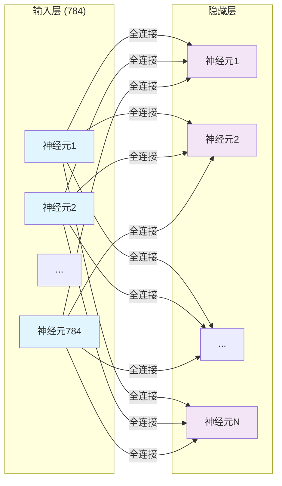
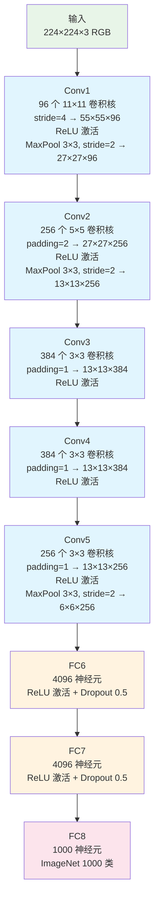
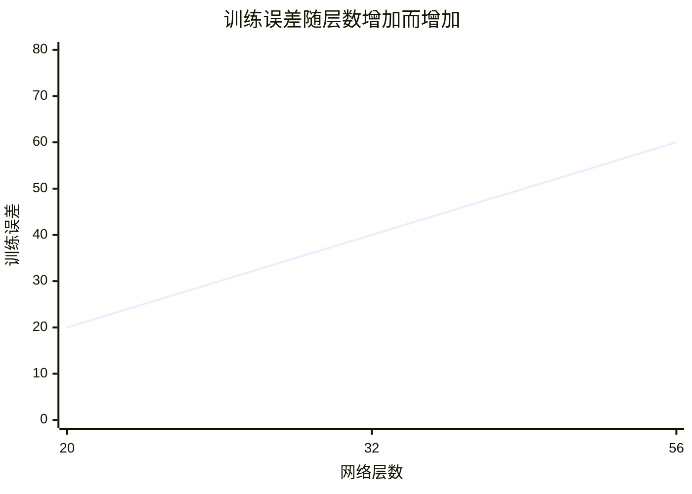
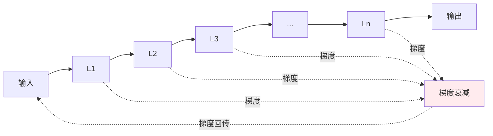

# 第 2 章：视觉感知——从像素到理解

> *"从像素到边缘，从边缘到物体——机器学会了『看』。"*
>
> —— 红莉栖

::: tip 故事背景
冈部在 Lab 里调试之前的多层感知机时发现了一个问题：同样的网络结构，换一张图片就完全失效了。红莉栖指出："问题在于，全连接层把图像的空间结构完全破坏了。我们需要一种能保留空间信息的网络结构。"

冈部陷入了沉思......突然，他想起了人类视觉系统的工作方式——初级视觉皮层 V1 中的神经元只接收局部区域的输入，然后逐层组合成更复杂的特征。

"我明白了！"冈部兴奋地说，"我们要让每个神经元只『看』一小块局部区域！"
:::

---

## 2.1 全连接层的局限

### 2.1.1 全连接层的问题

在第 1 章中，我们使用全连接层（Fully Connected Layer）来处理 MNIST 数据。全连接层中，每个神经元与上一层的所有神经元相连：



每个神经元都与上一层所有神经元相连

**问题 1：参数爆炸**

对于 28×28 的 MNIST 图像（784 维输入）：

```
784（输入） × 128（隐藏层） = 100,352 个参数

如果使用更大的图像，比如 224×224 的 ImageNet：
224 × 224 = 50,176 维输入
50,176 × 4096 = 205,520,896 个参数（仅第一层！）
```

**问题 2：失去空间结构**

```
原始图像：
┌─────────────────────┐
│  ████   左上角      │
│      ██             │
│        ████  右下角  │
└─────────────────────┘

展平后（784维向量）：
[█,█,█,█,0,0,...,0,█,█,0,0,...,█,█,█,█]

空间位置信息完全丢失！
```

**问题 3：无法处理平移**

```
同一个数字，只是位置不同：

  ┌─────┐         ┌─────┐
  │  5  │         │     │  5
  └─────┘         └─────┘

在全连接层看来，这是两个完全不同的输入
```

::: important 思考
1. 全连接层为什么要把每个神经元都连起来？
2. 这种"全连接"的设计，在处理图像时带来了哪些问题？
3. 人类视觉系统是怎么处理图像的？我们会区分图像中每个像素的位置吗？
:::

### 2.1.2 重新思考视觉处理

**人类的视觉系统：**

```
人类视觉处理过程：
│
├── 初级视觉皮层 V1：检测边缘、线条方向
│   │
│   ├── 简单细胞：检测特定方向的边缘
│   └── 复杂细胞：检测运动中的边缘
│
├── 次级视觉皮层 V2：识别形状、轮廓
│   └── 组合边缘形成更复杂的形状
│
└── 高级视觉皮层：识别物体、面部、场景
    └── 整合所有特征，识别具体物体
```

**关键洞察：**

1. **局部性**：每个神经元只接收局部区域的输入
2. **层次性**：从简单到复杂，逐步抽象
3. **平移不变性**：无论物体在视野的哪个位置，都能识别

**这正是卷积神经网络的设计灵感来源！**

---

## 2.2 卷积操作：局部连接与参数共享

### 2.2.1 卷积的核心思想

**核心思想：** 每个神经元只「看」一小块局部区域，相同的模式在图像各处共享。

```
卷积操作示意：

输入图像 (5×5)          卷积核 (3×3)         输出特征图 (3×3)
┌─────────┐           ┌─────────┐          ┌─────────┐
│ a b c d e │                   │ p q r │          │ • • • │
├─────────┤      ═══════▶       ├───────┤    ══▶   ├─────────┤
│ f g h i j │                    │ s t u │          │ • • • │
├─────────┤                    └───────┘          ├─────────┤
│ k l m n o │                                      │ • • • │
├─────────┤                                       └─────────┘
│ p q r s t │
├─────────┤    卷积核在图像上滑动，逐点相乘求和
│ u v w x y │
└─────────┘

• = 局部区域的加权和
```

**卷积过程详解：**

```
步骤 1：卷积核定位在图像左上角
┌─────────────────────┐
│ [a b c]             │
│ [f g h]   ← 3×3 区域 │
│ [k l m]             │
└─────────────────────┘

步骤 2：逐元素相乘，然后求和
结果 = a·p + b·q + c·r + f·s + g·t + h·u + k·q + l·s + m·t

步骤 3：卷积核向右移动一步，重复
步骤 4：移动到右边界后，向下一行
步骤 5：重复直到覆盖整个图像
```

::: info 数学知识
**离散卷积（Discrete Convolution）**

**定义：** 卷积是一种线性运算，通过滑动窗口（卷积核）计算局部加权和。

**一维离散卷积公式：**
$$
(y * w)[n] = \sum_{k=-\infty}^{\infty} x[k] \cdot w[n-k]
$$

**二维离散卷积公式：**
$$
(y * w)[i,j] = \sum_{k=-\infty}^{\infty} \sum_{l=-\infty}^{\infty} x[k,l] \cdot w[i-k, j-l]
$$

**深度学习中的"卷积"（实际上是互相关）：**
$$
(y \star w)[i,j] = \sum_{k=0}^{K-1} \sum_{l=0}^{K-1} w[k,l] \cdot x[i+k, j+l]
$$

**直观理解：** 卷积核在图像上滑动，每个位置计算核与图像patch的点积。

**在 AI 中的应用：** 卷积神经网络的核心操作，用于提取局部特征。
:::

### 2.2.2 参数共享：平移不变性的关键

**传统全连接：**

```
784 × 128 = 100,352 个参数
每个连接都是独立的，不共享
```

**卷积层：**

```
假设：输入 28×28，卷积核 3×3，输出通道 16

参数数量 = 3 × 3 × 16 = 144 个权重 + 16 个偏置 = 160 个参数

同一个卷积核扫遍整张图像，参数完全共享！
```

**为什么参数共享有效？**

```
图像中的模式是局部的，且在不同位置重复出现：

边缘检测器：在图像的任何位置都能检测到边缘
┌─────────────────────────────┐
│ ═══════  水平边缘           │
│ ───────  垂直边缘           │
│ ╲ ╱ ╱ ╲    对角边缘         │
│  ╲╱ ╲╱     等等...          │
└─────────────────────────────┘

同一个卷积核可以在所有位置检测相同的特征
```

::: info 数学知识
**卷积的性质**

**交换律：**
$$
x * w = w * x
$$

**结合律：**
$$
(x * w_1) * w_2 = x * (w_1 * w_2)
$$

**分配律：**
$$
x * (w_1 + w_2) = x * w_1 + x * w_2
$$

**平移不变性：** 如果输入平移，输出也会平移相同的量。

**在 AI 中的应用：** 这些性质保证了 CNN 对图像平移、旋转（一定程度上）的不变性。
:::

### 2.2.3 卷积层的重要参数

```python
import torch
import torch.nn as nn

# 创建卷积层
conv_layer = nn.Conv2d(
    in_channels=1,      # 输入通道数（灰度图=1，RGB=3）
    out_channels=16,    # 输出通道数（卷积核数量）
    kernel_size=3,      # 卷积核大小（3×3）
    stride=1,           # 步长（每次移动的距离）
    padding=1,          # 填充（保持空间尺寸）
    bias=True           # 是否使用偏置
)

print(f"参数数量: {sum(p.numel() for p in conv_layer.parameters())}")
# 输出：3×3×1×16 + 16 = 160 个参数
```

| 参数 | 含义 | 作用 |
|------|------|------|
| `in_channels` | 输入通道数 | 决定了输入特征图的深度（灰度图=1，RGB=3） |
| `out_channels` | 输出通道数 | 决定了提取多少种不同特征（多少个卷积核） |
| `kernel_size` | 卷积核大小 | 决定了感受野的大小（通常 3×3 或 5×5） |
| `stride` | 步长 | 控制卷积核移动的间隔，影响输出尺寸 |
| `padding` | 填充 | 控制在边界是否填充 0，影响输出尺寸 |

**输出尺寸计算：**

$$
H_{out} = \frac{H_{in} + 2 \times padding - kernel\_size}{stride} + 1
$$

### 2.2.4 池化操作：下采样

**为什么需要池化？**

```
卷积操作后，特征图仍然较大
池化可以：
1. 降低计算量
2. 提供平移不变性
3. 扩大感受野
```

**最大池化（Max Pooling）：**

```
2×2 最大池化，步长 2：

输入 (4×4)              输出 (2×2)
┌───────┬───────┐      ┌───────────┐
│  1  3 │  2  4 │      │  3   4    │
├───────┼───────┤  ══▶ ├───────────┤
│  5  2 │  6  8 │      │  6   8    │
├───────┼───────┤      │           │
│  9  1 │  3  2 │      └───────────┘
└───────┴───────┘
  每个 2×2 区域取最大值

└─────────────────────────────┘
       最大值：3, 4, 6, 8
```

**平均池化（Average Pooling）：**

```
2×2 平均池化：

输入 (4×4)              输出 (2×2)
┌───────┬───────┐      ┌───────────┐
│  1  3 │  2  4 │      │  2   3    │
├───────┼───────┤  ══▶ ├───────────┤
│  5  2 │  6  8 │      │  5   5    │
└───────┴───────┘      └───────────┘

每个 2×2 区域取平均值

└─────────────────────────────┘
       平均值：2, 3, 5, 5
```

::: info 数学知识
**池化操作的数学表达**

**最大池化：**
$$
y_{i,j} = \max \{ x_{i+s \cdot k, j+s \cdot l} \mid k, l \in [0, K) \}
$$

**平均池化：**
$$
y_{i,j} = \frac{1}{K^2} \sum_{k=0}^{K-1} \sum_{l=0}^{K-1} x_{i+s \cdot k, j+s \cdot l}
$$

**池化的作用：**
- 降低分辨率 → 减少计算量
- 局部平移不变性（池化区域内平移不影响输出）
- 扩大感受野（让后续层能"看到"更大区域）

**在 AI 中的应用：** CNN 中用于下采样，常用 2×2 池化，步长 2。
:::

```python
# PyTorch 池化层
max_pool = nn.MaxPool2d(kernel_size=2, stride=2)
avg_pool = nn.AvgPool2d(kernel_size=2, stride=2)
```

### 2.2.5 完整的卷积块

```python
import torch.nn as nn

class ConvBlock(nn.Module):
    """卷积块：卷积 → 激活 → 池化"""

    def __init__(self, in_channels, out_channels):
        super().__init__()
        self.conv = nn.Conv2d(
            in_channels=in_channels,
            out_channels=out_channels,
            kernel_size=3,
            padding=1
        )
        self.relu = nn.ReLU()
        self.pool = nn.MaxPool2d(kernel_size=2, stride=2)

    def forward(self, x):
        x = self.conv(x)      # 卷积
        x = self.relu(x)      # 激活
        x = self.pool(x)      # 池化
        return x

# 示例
block = ConvBlock(in_channels=1, out_channels=16)
print(block)
```

---

## 2.3 第一个卷积网络：LeNet

### 2.3.1 历史背景

**Yann LeCun (1998)** 提出了 LeNet-5，这是第一个成功的卷积神经网络，用于识别手写数字。

```mermaid
graph TD
    A[输入 (28×28×1)] --> B[卷积层 Conv1<br/>6 个 5×5<br/>→ 28×28×6]
    B --> C[池化层 AvgPool<br/>2×2<br/>→ 14×14×6]
    C --> D[卷积层 Conv2<br/>16 个 5×5<br/>→ 10×10×16]
    D --> E[池化层 AvgPool<br/>2×2<br/>→ 5×5×16]
    E --> F[全连接层 FC1<br/>120 个神经元]
    F --> G[全连接层 FC2<br/>84 个神经元]
    G --> H[输出层 (10)<br/>10 个数字类别]
    
    style A fill:#e8f5e8
    style H fill:#fce4ec
    style B fill:#e1f5fe
    style D fill:#e1f5fe
    style C fill:#f3e5f5
    style E fill:#f3e5f5
    style F fill:#fff3e0
    style G fill:#fff3e0
```

### 2.3.2 LeNet 代码实现

```python
import torch
import torch.nn as nn

class LeNet(nn.Module):
    """LeNet-5：手写数字识别网络"""

    def __init__(self, num_classes=10):
        super().__init__()

        # 特征提取部分
        self.features = nn.Sequential(
            # Conv1: 1×28×28 → 6×28×28 → 6×14×14
            nn.Conv2d(1, 6, kernel_size=5, padding=2),
            nn.Tanh(),           # LeNet 使用 Tanh 而非 ReLU
            nn.AvgPool2d(kernel_size=2, stride=2),

            # Conv2: 6×14×14 → 16×10×10 → 16×5×5
            nn.Conv2d(6, 16, kernel_size=5),
            nn.Tanh(),
            nn.AvgPool2d(kernel_size=2, stride=2),
        )

        # 分类部分
        self.classifier = nn.Sequential(
            nn.Flatten(),        # 展平：16×5×5 = 400
            nn.Linear(400, 120),
            nn.Tanh(),
            nn.Linear(120, 84),
            nn.Tanh(),
            nn.Linear(84, num_classes),
        )

    def forward(self, x):
        x = self.features(x)
        x = self.classifier(x)
        return x

# 创建模型
model = LeNet(num_classes=10)
print(f"模型参数量: {sum(p.numel() for p in model.parameters()):,}")
# 输出：约 60,000 个参数（相比全连接的 100,000+ 大幅减少）
```

### 2.3.3 可视化卷积核

**观察第一层卷积核：**

```python
import torch
import matplotlib.pyplot as plt
import torch.nn as nn

# 加载预训练 LeNet（如果有）
model = LeNet()

# 获取第一层卷积核
conv1_weights = model.features[0].weight.data

# 可视化 6 个卷积核
fig, axes = plt.subplots(1, 6, figsize=(15, 3))
for i, ax in enumerate(axes):
    kernel = conv1_weights[i, 0]  # 取第一个通道
    ax.imshow(kernel, cmap='gray')
    ax.set_title(f'Kernel {i+1}')
    ax.axis('off')

plt.tight_layout()
plt.savefig('lenet_kernels.png', dpi=150)
plt.show()
```

**你可能观察到的现象：**

```
卷积核可视化（简化）：

Kernel 1:  ←  水平边缘检测器
████████
████████
████████
████████
████████

Kernel 2:  ←  垂直边缘检测器
████
████
████
████
████

Kernel 3:  ←  对角线边缘
███
████
███

...
```

**核心洞察：**

- 第一层卷积核学习到的 **边缘检测器**
- 它们自动从数据中学习，不需要人工设计
- 不同卷积核检测不同方向的边缘

### 2.3.4 可视化中间层激活

```python
def visualize_activations(model, input_image):
    """可视化网络各层的激活图"""
    activations = {}

    # 注册钩子，捕获中间层输出
    def hook_fn(module, input, output):
        activations[module] = output.detach()

    # 选择要可视化的层
    layers = [
        model.features[0],  # Conv1
        model.features[3],  # Conv2
    ]

    for layer in layers:
        layer.register_forward_hook(hook_fn)

    # 前向传播
    with torch.no_grad():
        _ = model(input_image)

    # 可视化
    for layer_name, activation in activations.items():
        print(f"\n{layer_name}:")
        print(f"  形状: {activation.shape}")

        # 显示前几个通道
        n_show = min(6, activation.shape[1])
        fig, axes = plt.subplots(1, n_show, figsize=(12, 3))
        for i in range(n_show):
            ax = axes[i] if n_show > 1 else axes
            ax.imshow(activation[0, i].cpu().numpy(), cmap='viridis')
            ax.set_title(f'Channel {i+1}')
            ax.axis('off')
        plt.show()
```

**观察结果：**

```
Conv1 激活图 (6 个通道)：
┌─────────────────────────────────────┐
│ 边缘   边缘   纹理   纹理   ...      │
│ (水平) (垂直) (斜线) (曲线)          │
└─────────────────────────────────────┘

Conv2 激活图 (16 个通道)：
┌─────────────────────────────────────┐
│ 更复杂   更复杂   更复杂   ...       │
│ 的形状   的形状   的形状             │
│ (闭环)   (交叉)  (轮廓)             │
└─────────────────────────────────────┘
```

**层级特征学习的规律：**

| 层级 | 特征类型 | 说明 |
|------|----------|------|
| 第1层 | 边缘、纹理 | 最基础的视觉特征 |
| 第2层 | 形状、轮廓 | 组合边缘形成更复杂的结构 |
| 第3层+ | 语义概念 | 识别具体的物体部分 |

::: important 实验任务
1. 运行 LeNet 代码，在 MNIST 上训练并测试
2. 可视化第一层卷积核，观察学到了什么
3. 可视化中间层激活，理解层级特征提取
4. 尝试修改网络结构（增加层数、改变通道数），观察效果变化
:::

---

## 2.4 经典架构演进：从 LeNet 到 ResNet

### 2.4.1 AlexNet：深度学习的复兴（2012）

**2012 年 ImageNet 大赛：**

```
AlexNet 成绩：
- Top-5 错误率：15.3%（第二名 26.2%）
- 超越传统方法超过 10 个百分点！
- 震撼了整个计算机视觉界
```

**AlexNet vs LeNet：**

| 对比 | LeNet (1998) | AlexNet (2012) |
|------|--------------|----------------|
| 图像尺寸 | 28×28 | 224×224 |
| 参数数量 | ~6 万 | ~6000 万 |
| 层数 | 5 层 | 8 层 |
| 激活函数 | Tanh | ReLU |
| 正则化 | 无 | Dropout |
| 训练硬件 | CPU | 2×GPU |

**AlexNet 架构详解：**



**AlexNet 的关键创新：**

**创新 1：ReLU 激活函数**

```python
# AlexNet 使用 ReLU 而非 Tanh/Sigmoid
self.relu = nn.ReLU(inplace=True)

# ReLU 的优势：
# 1. 计算简单：max(0, x)
# 2. 梯度不饱和：正区间梯度恒为 1
# 3. 稀疏激活：输出为 0 的神经元不参与计算
```

```
ReLU vs Sigmoid 梯度对比：

Sigmoid:                    ReLU:
    ┌──────┐                    ┌───┐
    │ ╲    │                    │╲  │
────┘  └───┘                ────┘   └─────
   -3  0  3                    0      x

梯度饱和（两端趋近0）        梯度恒为1（正区间）
```

**创新 2：Dropout 正则化**

```python
self.dropout = nn.Dropout(p=0.5)  # 随机丢弃 50% 的神经元
```

**Dropout 工作原理：**

```
训练时：                    测试时：
┌─────────────┐            ┌─────────────┐
│ ○ ─── ○     │            │   ○         │
│ │ ×   │     │   ══▶      │     │       │
│ ○     ○     │            │   ○         │
└─────────────┘            └─────────────┘

× = 被丢弃的神经元        所有神经元都参与
（不参与前向/反向传播）   输出乘以 0.5
```

**Dropout 的作用：**

| 方面 | 说明 |
|------|------|
| 防止过拟合 | 强制网络学习冗余表示 |
| 模型集成 | 每次训练相当于训练不同的子网络 |
| 减少神经元共适应 | 防止某些神经元过度依赖特定特征 |

**创新 3：GPU 并行训练**

```python
# AlexNet 使用 2 张 GPU 训练
# 将网络分成两部分，分别在两张卡上运行

# 现代 PyTorch 自动处理 GPU 并行
device = torch.device('cuda' if torch.cuda.is_available() else 'cpu')
model = model.to(device)
```

**AlexNet 代码实现：**

```python
import torch
import torch.nn as nn

class AlexNet(nn.Module):
    """AlexNet：深度学习复兴之作"""

    def __init__(self, num_classes=1000):
        super().__init__()

        self.features = nn.Sequential(
            # Conv1
            nn.Conv2d(3, 96, kernel_size=11, stride=4, padding=2),
            nn.ReLU(inplace=True),
            nn.MaxPool2d(kernel_size=3, stride=2),

            # Conv2
            nn.Conv2d(96, 256, kernel_size=5, padding=2),
            nn.ReLU(inplace=True),
            nn.MaxPool2d(kernel_size=3, stride=2),

            # Conv3-5
            nn.Conv2d(256, 384, kernel_size=3, padding=1),
            nn.ReLU(inplace=True),

            nn.Conv2d(384, 384, kernel_size=3, padding=1),
            nn.ReLU(inplace=True),

            nn.Conv2d(384, 256, kernel_size=3, padding=1),
            nn.ReLU(inplace=True),
            nn.MaxPool2d(kernel_size=3, stride=2),
        )

        self.classifier = nn.Sequential(
            nn.Dropout(p=0.5),
            nn.Linear(256 * 6 * 6, 4096),
            nn.ReLU(inplace=True),

            nn.Dropout(p=0.5),
            nn.Linear(4096, 4096),
            nn.ReLU(inplace=True),

            nn.Linear(4096, num_classes),
        )

    def forward(self, x):
        x = self.features(x)
        x = torch.flatten(x, 1)  # 展平
        x = self.classifier(x)
        return x

model = AlexNet(num_classes=1000)
print(f"AlexNet 参数量: {sum(p.numel() for p in model.parameters()):,}")
# 输出：约 61,000,000 个参数
```

### 2.4.2 VGG：更深更简单（2014）

**VGG 的设计哲学：**

**核心思想：使用小卷积核的重复堆叠**

```
AlexNet 的卷积核：
11×11, 5×5, 3×3, 3×3, 3×3

VGG 的卷积核：
全部使用 3×3！
```

**为什么小卷积核更好？**

```
感受野对比：

3 个 3×3 卷积堆叠：
┌─────────────────┐
│    ┌─────┐      │
│    │┌───┐│      │
│    ││3×3││      │
│    │└───┘│      │
│    └─────┘      │
│  等效于 7×7 的感受野
└─────────────────┘

参数量对比：

1 个 7×7 卷积：
7×7 = 49 个参数

3 个 3×3 卷积：
3×(3×3) = 27 个参数（更少！）

优势：
1. 参数更少
2. 更多非线性层（3 次 ReLU vs 1 次）
3. 更好的特征学习
```

**VGG 架构：**

```mermaid
graph TD
    A[输入<br/>224×224×3] --> B[2× Conv(64) + Pool<br/>→ 112×112×64]
    B --> C[2× Conv(128) + Pool<br/>→ 56×56×128]
    C --> D[3× Conv(256) + Pool<br/>→ 28×28×256]
    D --> E[3× Conv(512) + Pool<br/>→ 14×14×512]
    E --> F[3× Conv(512) + Pool<br/>→ 7×7×512]
    F --> G[FC(4096) → FC(4096) → FC(1000)]
    
    style A fill:#e8f5e8
    style G fill:#fce4ec
    style B fill:#e1f5fe
    style C fill:#e1f5fe
    style D fill:#e1f5fe
    style E fill:#e1f5fe
    style F fill:#e1f5fe
```

**VGG 变体对比：**

| 模型 | 层数 | 参数量 | Top-5 错误率 |
|------|------|--------|--------------|
| VGG-11 | 11 | 133M | 10.4% |
| VGG-13 | 13 | 134M | 9.6% |
| VGG-16 | 16 | 138M | 9.2% |
| VGG-19 | 19 | 144M | 9.0% |

**VGG 代码实现：**

```python
import torch
import torch.nn as nn

class VGG(nn.Module):
    """VGG：更深的网络，更小的卷积核"""

    def __init__(self, num_classes=1000):
        super().__init__()

        # VGG 块配置
        self.features = self._make_layers([
            # in_channels, out_channels, num_conv
            [3, 64, 2],   # Conv block 1
            [64, 128, 2], # Conv block 2
            [128, 256, 3],# Conv block 3
            [256, 512, 3],# Conv block 4
            [512, 512, 3],# Conv block 5
        ])

        # 分类器
        self.classifier = nn.Sequential(
            nn.Linear(512 * 7 * 7, 4096),
            nn.ReLU(inplace=True),
            nn.Dropout(),

            nn.Linear(4096, 4096),
            nn.ReLU(inplace=True),
            nn.Dropout(),

            nn.Linear(4096, num_classes),
        )

    def _make_layers(self, cfg):
        layers = []
        in_channels = cfg[0][0]

        for out_channels, num_conv in cfg:
            # 添加多个 3×3 卷积层
            for _ in range(num_conv):
                layers.append(nn.Conv2d(in_channels, out_channels, kernel_size=3, padding=1))
                layers.append(nn.ReLU(inplace=True))
                in_channels = out_channels

            # 添加池化层
            layers.append(nn.MaxPool2d(kernel_size=2, stride=2))

        return nn.Sequential(*layers)

    def forward(self, x):
        x = self.features(x)
        x = torch.flatten(x, 1)
        x = self.classifier(x)
        return x

# VGG-16
model = VGG(num_classes=1000)
print(f"VGG-16 参数量: {sum(p.numel() for p in model.parameters()):,}")
# 输出：约 138,000,000 参数
```

### 2.4.3 ResNet：突破深度极限（2015）

**深度网络的困境：**

**问题：更深的网络反而性能更差**



这不是过拟合，而是训练困难！

**梯度消失问题：**



每层都乘以一个小于 1 的数（梯度衰减），
层数越多，梯度越小，权重无法更新。

**残差连接：核心创新**

**核心思想：让网络学习「残差」而不是「映射」**

```mermaid
graph TD
    subgraph "普通连接"
        A1[输入 x] --> B1[F(x)]
        B1 --> C1[输出 h(x) = F(x)]
    end
    
    subgraph "残差连接"
        A2[输入 x] --> B2[F(x)]
        A2 --> C2[+]
        B2 --> C2
        C2 --> D2[输出 h(x) = F(x) + x]
        
        A2 -.->|捷径连接<br/>shortcut| C2
    end
    
    style C2 fill:#e8f5e8
```

**数学表达：**

```
普通网络：    h(x) = F(x)

残差网络：    h(x) = F(x) + x
             其中 F(x) = W2·σ(W1·x)
```

**残差连接的意义：**

```
梯度传播路径：

普通网络：
x ──► L1 ──► L2 ──► L3 ──► ... ──► Loss
              ↓
         梯度衰减

残差网络：
x ───┬───► L1 ──► L2 ──► ... ──► Loss
     │                              ↑
     └──────────────────────────────┘
         梯度可以通过捷径直接回传

即使梯度在某一层衰减，捷径连接仍能保持梯度！
```

::: info 数学知识
**残差连接的梯度分析**

**普通连接的梯度（链式法则）：**
$$
\frac{\partial L}{\partial x} = \frac{\partial L}{\partial h} \cdot \frac{\partial h}{\partial x}
$$

如果每层的雅可比矩阵 $\frac{\partial h_i}{\partial h_{i-1}}$ 的特征值都小于 1，梯度会指数衰减。

**残差连接的梯度：**
$$
\frac{\partial L}{\partial x} = \frac{\partial L}{\partial h} \cdot \left( \mathbf{I} + \frac{\partial F}{\partial x} \right)
$$

即使 $\frac{\partial F}{\partial x}$ 很小，梯度仍然可以通过 $\mathbf{I}$（单位矩阵）直接传递！

**在 AI 中的应用：** ResNet 的核心创新，解决了深度网络的梯度消失问题，使训练 100+ 层的网络成为可能。
:::

**ResNet 架构：**

```
ResNet-34 结构：

输入 (224×224×3)
    │
    ▼
┌─────────────────────────────────────────┐
│ Conv1: 7×7, 64, stride=2                │
│ MaxPool (3×3, stride=2)                 │  →  56×56×64
└─────────────────────────────────────────┘
    │
    ▼
┌─────────────────────────────────────────┐
│ Conv2_x: 3 个残差块                      │
│ 每个块：2 个 3×3 卷积                    │  →  56×56×64
└─────────────────────────────────────────┘
    │
    ▼
┌─────────────────────────────────────────┐
│ Conv3_x: 4 个残差块                      │
│ 特征图减半，通道数加倍                    │  →  28×28×128
└─────────────────────────────────────────┘
    │
    ▼
┌─────────────────────────────────────────┐
│ Conv4_x: 6 个残差块                      │  →  14×14×256
└─────────────────────────────────────────┘
    │
    ▼
┌─────────────────────────────────────────┐
│ Conv5_x: 3 个残差块                      │  →  7×7×512
└─────────────────────────────────────────┘
    │
    ▼
┌─────────────────────────────────────────┐
│ Global Average Pooling                  │  →  512
└─────────────────────────────────────────┘
    │
    ▼
┌─────────────────────────────────────────┐
│ FC(1000)                                │
└─────────────────────────────────────────┘
```

**残差块结构：**

```
残差块（Basic Block）：

输入 x
    │
    ├──► Conv3×3 ──► BN ──► ReLU ──► Conv3×3 ──► BN
    │                                                │
    └──► Conv1×1（匹配维度）─────────────────────────┘
              │
              ▼
         x + F(x)  ←  元素级相加
              │
              ▼
           ReLU（激活）
              │
              ▼
           输出
```

**ResNet 代码实现：**

```python
import torch
import torch.nn as nn

class BasicBlock(nn.Module):
    """ResNet 基本残差块"""

    expansion = 1  # 输出通道数是输入的多少倍

    def __init__(self, in_channels, out_channels, stride=1):
        super().__init__()
        self.conv1 = nn.Conv2d(
            in_channels, out_channels, kernel_size=3, stride=stride, padding=1, bias=False
        )
        self.bn1 = nn.BatchNorm2d(out_channels)
        self.relu = nn.ReLU(inplace=True)

        self.conv2 = nn.Conv2d(
            out_channels, out_channels, kernel_size=3, stride=1, padding=1, bias=False
        )
        self.bn2 = nn.BatchNorm2d(out_channels)

        # 捷径连接：如果维度变化，用 1×1 卷积调整
        self.shortcut = nn.Sequential()
        if stride != 1 or in_channels != out_channels * self.expansion:
            self.shortcut = nn.Sequential(
                nn.Conv2d(
                    in_channels, out_channels * self.expansion,
                    kernel_size=1, stride=stride, bias=False
                ),
                nn.BatchNorm2d(out_channels * self.expansion),
            )

    def forward(self, x):
        identity = self.shortcut(x)
        out = self.conv1(x)
        out = self.bn1(out)
        out = self.relu(out)

        out = self.conv2(out)
        out = self.bn2(out)

        out += identity  # 残差连接
        out = self.relu(out)

        return out


class ResNet(nn.Module):
    """ResNet：残差网络"""

    def __init__(self, block, num_blocks, num_classes=1000):
        super().__init__()
        self.in_channels = 64

        self.conv1 = nn.Conv2d(3, 64, kernel_size=7, stride=2, padding=3, bias=False)
        self.bn1 = nn.BatchNorm2d(64)
        self.relu = nn.ReLU(inplace=True)
        self.maxpool = nn.MaxPool2d(kernel_size=3, stride=2, padding=1)

        self.layer1 = self._make_layer(block, 64, num_blocks[0], stride=1)
        self.layer2 = self._make_layer(block, 128, num_blocks[1], stride=2)
        self.layer3 = self._make_layer(block, 256, num_blocks[2], stride=2)
        self.layer4 = self._make_layer(block, 512, num_blocks[3], stride=2)

        self.avgpool = nn.AdaptiveAvgPool2d((1, 1))
        self.fc = nn.Linear(512 * block.expansion, num_classes)

    def _make_layer(self, block, out_channels, num_blocks, stride):
        layers = []
        layers.append(block(self.in_channels, out_channels, stride))
        self.in_channels = out_channels * block.expansion
        for _ in range(1, num_blocks):
            layers.append(block(self.in_channels, out_channels, 1))
        return nn.Sequential(*layers)

    def forward(self, x):
        x = self.conv1(x)
        x = self.bn1(x)
        x = self.relu(x)
        x = self.maxpool(x)

        x = self.layer1(x)
        x = self.layer2(x)
        x = self.layer3(x)
        x = self.layer4(x)

        x = self.avgpool(x)
        x = torch.flatten(x, 1)
        x = self.fc(x)
        return x


def ResNet18():
    return ResNet(BasicBlock, [2, 2, 2, 2])

def ResNet34():
    return ResNet(BasicBlock, [3, 4, 6, 3])

# 测试
model = ResNet18()
print(f"ResNet-18 参数量: {sum(p.numel() for p in model.parameters()):,}")
# 输出：约 11,000,000 参数
```

**ResNet 性能对比：**

```
ImageNet Top-5 错误率对比：

     错误率
       │
   28% │ ████
       │ ████ VGG-19 (7.3%)
   24% │ ████
       │ ████
   20% │ ████ ResNet-152 (3.6%)
       │ ████
   16% │ ████
       │ ████
   12% │ ████
       │ ████ AlexNet (15.3%)
    8% │ ████
       │ ████
    4% │ ████
       │ ████
    0% └──────────────────────
         VGG AlexNet ResNet
```

---

## 2.5 第二世界线小结

### 核心概念回顾

| 概念 | 说明 |
|------|------|
| **全连接层的局限** | 参数爆炸、失去空间结构、无法处理平移 |
| **卷积操作** | 局部连接 + 参数共享，保留空间信息 |
| **卷积核** | 提取特定模式的"过滤器"，如边缘检测器 |
| **参数共享** | 同一卷积核在图像各处使用，大幅减少参数 |
| **池化操作** | 下采样，降低计算量，提供平移不变性 |
| **LeNet** | 第一个成功的卷积神经网络（1998） |
| **AlexNet** | 深度学习复兴之作，引入 ReLU、Dropout、GPU 训练 |
| **VGG** | 统一使用 3×3 小卷积核，重复堆叠 |
| **残差连接** | F(x) + x，缓解梯度消失，训练超深网络 |
| **层级特征** | 从边缘到纹理到形状，层层抽象 |

### 本章数学知识汇总

```
第 2 章数学知识地图：

┌─────────────────────────────────────────────────────────┐
│                   卷积数学                                │
│  ┌──────────┐  ┌──────────┐  ┌──────────┐              │
│  │离散卷积  │  │ 卷积性质 │  │ 池化操作 │              │
│  └──────────┘  └──────────┘  └──────────┘              │
├─────────────────────────────────────────────────────────┤
│                   优化理论                                │
│  ┌──────────┐                                            │
│  │残差梯度  │  ←  残差连接如何解决梯度消失                │
│  └──────────┘                                            │
└─────────────────────────────────────────────────────────┘
```

### 经典架构演进

```
架构演进时间线：

1998         2012         2014         2015
  │            │            │            │
  ▼            ▼            ▼            ▼
LeNet ──► AlexNet ──► VGG ──► ResNet
  │         │         │         │
  │         │         │         │
  5层      8层      16-19层   18-152层
 6万参数  6000万    1.38亿    1100万+

创新点：
  ·       ReLU     3×3卷积   残差连接
         Dropout    堆叠     跳跃连接
         GPU训练
```

### 章节要点

1. **全连接层的局限**：参数爆炸、丢失空间结构、无法处理平移

2. **卷积的核心思想**：局部连接 + 参数共享，保留空间信息

3. **参数共享的意义**：相同的模式在图像各处出现，卷积核可以共享使用

4. **池化的作用**：降低计算量，扩大感受野，提供平移不变性

5. **层级特征学习**：从简单到复杂，逐步抽象，从边缘到语义概念

6. **残差连接的意义**：F(x) + x 创造了梯度直接通路，解决了深度网络的训练难题

### 本章任务

::: important 本章任务清单
- [ ] 理解全连接层处理图像的问题
- [ ] 掌握卷积操作的计算过程
- [ ] 实现 LeNet 网络结构
- [ ] 可视化卷积核，理解学到的特征
- [ ] 可视化中间层激活，理解层级特征
- [ ] 思考：卷积神经网络为什么能保留空间结构？
- [ ] 实现 ResNet BasicBlock，理解残差块结构
- [ ] 思考：残差连接为什么能缓解梯度消失？
- [ ] 扩展阅读：了解 Bottleneck 结构和更深的 ResNet
:::

### 预告

下一章，我们将进入**第三世界线（序列记忆）**，学习循环神经网络（RNN）和 LSTM，看看机器是如何理解"时间"和"序列"的。

> *"当机器有了记忆，它开始理解时间的流动。"*
>
> —— 冈部

> *"从简单到复杂，从浅层到深层——每一次架构的革新，都是对视觉理解边界的一次突破。"*
>
> —— 红莉栖