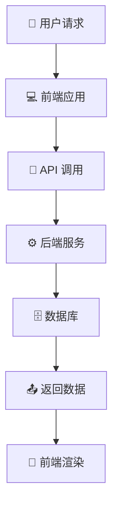
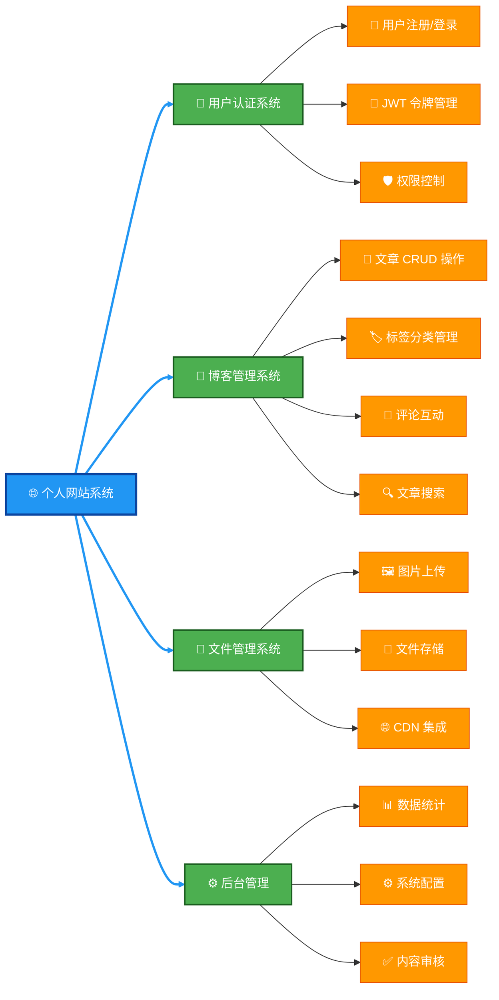
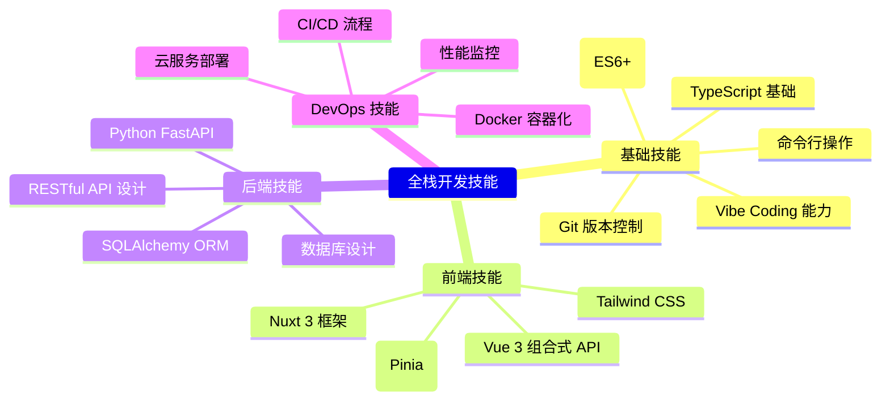

# 第 1 章：全栈开发导论与课程介绍

欢迎进入全栈开发的奇妙世界！这一章将为你打开通往现代 Web 开发的大门，让我们一起探索全栈开发的精髓与魅力。

---

## 1.1 什么是前后端分离架构

### 定义与概念

前后端分离架构就像是一家分工明确的餐厅：前端是亲切的服务员，负责与顾客（用户）直接交互，展示精美的菜单（UI），记录顾客的点餐需求（用户输入）；后端则是高效的厨房团队，专注于准备美味的菜品（处理业务逻辑），管理食材库存（数据库），并通过传菜窗口（API）将做好的菜品送到前端。

在这种架构中：
- 前端负责 UI 渲染、用户交互和数据展示
- 后端专注于数据处理、业务逻辑和 API 提供
- 前后端通过 RESTful API 或 GraphQL 进行数据通信

### 架构优势

为什么前后端分离架构如此受欢迎？就像现代企业的专业化分工一样，它带来了诸多优势：

- **开发效率**：前后端团队如同两个并行工作的引擎，可以同时开发，互不等待
- **技术栈灵活**：前端可以选择最适合展示的技术（如 Vue、React），后端可以选择最适合业务的技术（如 Python、Java），就像厨师可以选择最适合的厨具
- **易于维护**：每个模块职责单一明确，就像餐厅里每个人都知道自己的具体任务
- **扩展性强**：同一套后端 API 可以服务于网站、手机 App、平板等多种前端，就像一个厨房可以同时为堂食、外卖和打包服务

### 技术实现流程



---

## 1.2 Nuxt.js 与 FastAPI 技术栈优势

选择合适的技术栈就像选择最适合的交通工具：如果你要追求速度和舒适，高铁会是理想选择；如果要翻山越岭，越野车可能更合适。在全栈开发中，Nuxt.js 和 FastAPI 的组合就是这样一对黄金搭档。

### Nuxt.js 核心优势

Nuxt.js 就像是前端开发中的瑞士军刀，功能强大且使用便捷：

- **全栈能力**：基于 Vue 3，支持服务端渲染 (SSR)、静态站点生成 (SSG)，就像一辆既能在公路上飞驰，又能在越野路上稳健行驶的多功能车
- **开发体验**：文件系统路由、自动导入、热更新，让开发过程如同在高铁上办公一样高效舒适
- **性能优化**：自动代码分割、智能预加载、图片优化，就像给网站穿上了一双轻盈的跑鞋
- **TypeScript 支持**：完整的 TS 类型支持，提升开发质量，就像有了一个严格的质量检查员

### FastAPI 技术亮点

FastAPI 则是后端世界的短跑冠军，速度快且易于使用：

- **高性能**：基于 Starlette 和 Pydantic，性能接近 Node.js 和 Go，就像一辆超级跑车
- **开发效率**：自动 API 文档、类型注解、编辑器支持，让后端开发如同乘坐磁悬浮列车一样高效
- **现代标准**：完全支持异步编程、OpenAPI、JSON Schema，就像采用了最新的通信标准
- **安全性**：内置数据验证、序列化、身份验证，就像给你的应用加上了多重安全防护

### 技术栈协同优势

当 Nuxt.js 遇到 FastAPI，就像是最佳搭档相遇，产生了奇妙的化学反应：

```python
# FastAPI 提供类型安全的 API
@app.get("/articles/{article_id}")
async def read_article(article_id: int) -> ArticleSchema:
    return await get_article(article_id)
```

```typescript
// Nuxt.js 享受类型安全的 API 调用
const { data: article } = await useFetch<Article>('/api/articles/1')
```

这种类型安全的协作方式，就像是两个人使用同一种语言进行无缝沟通，大大减少了误解和错误。

---

## 1.3 个人网站项目功能规划

我们将要构建的个人网站项目，就像是一座数字王国，由多个功能模块组成，每个模块都有其独特的职责和功能。

### 核心功能模块



### 技术特性规划

我们的个人网站将具备现代 Web 应用的各种先进特性，就像一辆配备了最新科技的智能汽车：

- 响应式设计，支持 PC 和移动端 — 就像一辆可以在各种路况下平稳行驶的车
- SEO 优化，支持服务端渲染 — 让你的网站在搜索引擎中就像明亮的灯塔一样引人注目
- 实时搜索和过滤功能 — 就像拥有一个智能导航系统，可以快速找到你想去的地方
- 暗黑模式主题切换 — 就像汽车的智能灯光系统，可以根据环境自动调整
- 国际化多语言支持 — 就像一个精通多国语言的翻译，可以与全球用户沟通

---

## 1.4 学习目标与预期成果

学习全栈开发就像是攀登一座高山，我们不仅要欣赏沿途的风景，更要到达山顶，俯瞰整个世界。

### 技术能力目标

通过本课程的学习，你将获得全栈开发的核心能力，就像一位掌握了多种技艺的能工巧匠：

- 掌握全栈开发完整流程 — 从设计图纸到最终成品的全过程
- 熟练使用 Vue 3 + Nuxt 3 开发现代 Web 应用 — 就像熟练使用各种精密工具
- 掌握 FastAPI 构建高性能后端 API — 就像懂得如何设计和建造坚固的地基
- 理解前后端分离架构设计思想 — 就像掌握了建筑的设计原理
- 具备独立部署和维护全栈项目能力 — 就像能够独立管理和维护一座建筑

### 项目成果

完成本课程后，你将拥有一系列令人骄傲的成果，就像一位建筑师完成了自己的代表作：

- 完整的个人网站项目源码 — 你的数字作品集
- 生产环境部署配置 — 让你的作品可以在互联网上展示
- 项目文档和技术笔记 — 记录你学习和成长的历程
- GitHub 代码仓库和 CI/CD 流水线 — 就像作品的展示厅和生产线

### 技能树构建

全栈开发的技能就像一棵不断生长的大树，需要坚实的根基和茂盛的枝叶：



随着你不断学习和实践，这棵技能树将会越来越茂盛，最终成长为参天大树！