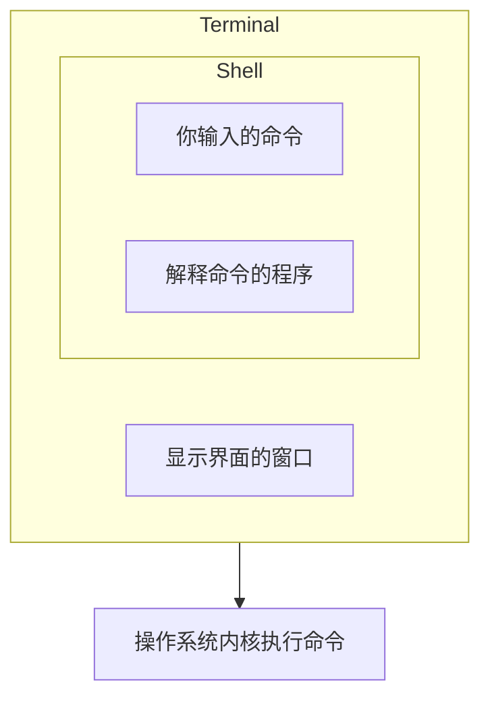
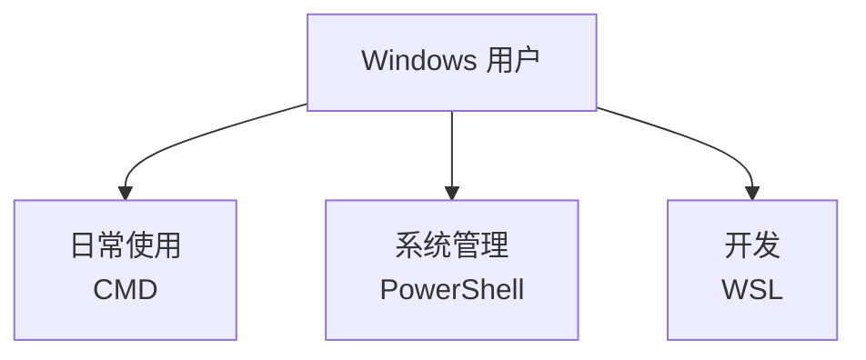

# 第 4 章：Shell 的世界

::: tip 本章目标
理解什么是 Shell，认识 CMD、PowerShell、Bash 等主流 Shell 的历史和特点，学会在不同环境下选择合适的 Shell。
:::

## 一、 🐚 什么是 Shell？

你可能已经注意到，我们一直在说「命令行」「终端」「Shell」这些词，它们是一回事吗？

让我们来理清这些概念：

### 1.1. 终端（Terminal）

**终端** 是你看到的那个窗口——一个可以显示文字、接收键盘输入的界面。

- 在历史上，终端是一个实体设备（还记得 VT100 吗？）
- 在现代，终端是一个软件程序，模拟了那些古老设备的功能
- 例如：Windows Terminal、macOS Terminal、iTerm2、GNOME Terminal

### 1.2. Shell

**Shell** 是运行在终端里的程序，负责解释你输入的命令并执行。

- Shell 是「外壳」的意思——它是操作系统内核（Kernel）的「外壳」
- 你输入命令 → Shell 理解并翻译 → 操作系统执行
- 例如：CMD、PowerShell、Bash、Zsh、Fish

::: info 一个比喻
想象一下翻译官的工作：
- **你（用户）**：说中文（输入命令）
- **翻译官（Shell）**：把你的话翻译成对方能懂的语言
- **外国人（操作系统内核）**：执行任务

不同的翻译官有不同的风格——有的严谨，有的幽默，有的支持更多语法。Shell 也是一样。
:::

### 1.3. 它们的关系



## 二、 📜 Shell 家族的故事

### 2.1. 一切始于 Unix Shell（1971）

Unix 系统诞生后不久，Ken Thompson 就开发了第一个 Unix Shell，简称 **sh**。

这个朴素的 Shell 奠定了很多基础：
- 命令通过空格分隔参数
- 用 `|` 做管道
- 用 `>` 和 `<` 做重定向
- 用 `&` 在后台运行命令

### 2.2. Bourne Shell（1979）

Stephen Bourne 在贝尔实验室重新设计了 Unix Shell，这就是著名的 **Bourne Shell（sh）**。

它引入了：
- `if`/`then`/`fi` 条件语句
- `for`/`do`/`done` 循环
- 更强大的脚本功能

几乎所有现代 Unix/Linux Shell 都是 Bourne Shell 的后代。

### 2.3. Bash（1989）

GNU 项目的 Brian Fox 开发了 **Bash（Bourne Again Shell）**——「又一个 Bourne Shell」。

::: note 名字的双关
「Bourne Again」既是「Bourne 的又一个版本」，又谐音「Born Again（重生）」。程序员的冷幽默。
:::

Bash 在 Bourne Shell 的基础上增加了大量功能：
- 命令历史（按 ↑ 浏览之前的命令）
- Tab 自动补全
- 更强大的脚本功能
- 命令别名

Bash 后来成为大多数 Linux 发行版和 macOS（直到 Catalina）的默认 Shell。

### 2.4. Zsh（1990）

Paul Falstad 在普林斯顿大学开发了 **Zsh**，目标是「最强大的 Shell」。

Zsh 的特点：
- 兼容 Bash 语法
- 更强大的自动补全
- 插件和主题系统
- 拼写纠正

macOS Catalina（2019）开始，默认 Shell 从 Bash 改为 Zsh。

### 2.5. 其他有趣的 Shell

- **Fish**：「Finally, a command line shell for the 90s」（终于有一个为 90 年代设计的 Shell）。语法与众不同，但对新手非常友好。
- **Csh/Tcsh**：C 语言风格的 Shell，语法像 C。
- **Dash**：轻量级的 Bourne Shell 实现，启动快，常用于系统脚本。

## 三、 🪟 Windows 的 Shell 故事

Windows 的命令行有一段完全不同的历史。

### 3.1. CMD（1981 ~ 至今）

**CMD（Command Prompt）** 的祖先是 MS-DOS 的命令行解释器 COMMAND.COM。

当 Windows NT（1993）发布时，CMD.EXE 取代了 COMMAND.COM，但保持了大部分兼容性。

CMD 的特点：
- 语法古老，能力有限
- 命令不区分大小写
- 批处理脚本（.bat 文件）
- 主要用于向后兼容

::: note MS-DOS 的幽灵
即使到了 Windows 11，CMD 依然保留着很多 DOS 时代的「遗产」：
- `dir` 而不是 `ls`
- `copy` 而不是 `cp`
- `del` 而不是 `rm`
- 用 `\` 作为路径分隔符

这些设计决策可以追溯到 1981 年的 MS-DOS 1.0！
:::

### 3.2. PowerShell（2006 ~ 至今）

微软意识到 CMD 太落后了，于是在 2006 年推出了 **PowerShell**。

PowerShell 是一个革命性的设计：
- **基于 .NET Framework**：可以调用任何 .NET 功能
- **对象化**：命令输出的不是文本，而是结构化的对象
- **动词-名词命名**：`Get-Process`、`Set-Location`、`Remove-Item`
- **别名系统**：`ls` 是 `Get-ChildItem` 的别名

```powershell
# 获取所有进程，筛选内存大于 100MB 的
Get-Process | Where-Object { $_.WorkingSet64 -gt 100MB }

# 在 Bash 里做同样的事要复杂得多
```

::: tip PowerShell 的野心
PowerShell 不仅仅是一个命令行工具，它还是一个完整的自动化平台和配置管理工具。它甚至跨平台——PowerShell Core（后来的 PowerShell 7）可以在 Windows、Linux、macOS 上运行！
:::

### 3.3. Windows Terminal（2019）

Windows Terminal 是微软推出的现代终端应用：
- 支持多标签页
- 可以同时运行 CMD、PowerShell、WSL
- 支持 GPU 加速渲染
- 丰富的自定义选项

如果你用的是 Windows 10/11，强烈建议安装 Windows Terminal！

## 四、 🐧 WSL：在 Windows 上运行 Linux

**WSL（Windows Subsystem for Linux）** 是微软的一个神奇功能：它让你能在 Windows 上原生运行 Linux 环境！

### 4.1. WSL 是什么？

- **WSL 1**：通过翻译层把 Linux 系统调用转换成 Windows 系统调用
- **WSL 2**：运行一个真正的 Linux 内核（在轻量级虚拟机中）

### 4.2. 为什么要用 WSL？

1. **学习 Linux**：不用装双系统或虚拟机
2. **开发便利**：很多开发工具在 Linux 上体验更好
3. **Docker 支持**：WSL 2 是 Docker Desktop for Windows 的最佳后端
4. **命令一致**：使用和服务器相同的命令

### 4.3. 安装 WSL

在 PowerShell（管理员）中运行：
```powershell
wsl --install
```

这会安装 WSL 2 和 Ubuntu。重启后就能使用了！

::: note 微软的转变
曾几何时，微软把 Linux 视为「癌症」。如今，微软不仅拥抱开源，还把 Linux 带进了 Windows。时代真的变了！
:::

## 五、 🔄 各 Shell 命令对照表

| 操作 | Bash/Zsh | PowerShell | CMD |
|------|----------|------------|-----|
| 列出文件 | `ls` | `Get-ChildItem` (alias: `ls`, `dir`) | `dir` |
| 切换目录 | `cd` | `Set-Location` (alias: `cd`) | `cd` |
| 当前目录 | `pwd` | `Get-Location` (alias: `pwd`) | `cd` |
| 复制文件 | `cp` | `Copy-Item` (alias: `cp`, `copy`) | `copy` |
| 移动文件 | `mv` | `Move-Item` (alias: `mv`, `move`) | `move` |
| 删除文件 | `rm` | `Remove-Item` (alias: `rm`, `del`) | `del` |
| 创建目录 | `mkdir` | `New-Item -Type Directory` (alias: `mkdir`) | `mkdir` |
| 显示文件 | `cat` | `Get-Content` (alias: `cat`, `type`) | `type` |
| 清屏 | `clear` | `Clear-Host` (alias: `clear`, `cls`) | `cls` |
| 获取帮助 | `man cmd` | `Get-Help cmd` | `cmd /?` |

## 六、 🎯 该选择哪个 Shell？

### 6.1. Windows 用户建议



- **CMD**：简单任务、老脚本兼容
- **PowerShell**：系统管理、自动化、现代脚本
- **WSL**：Web 开发、使用 Linux 工具链

### 6.2. macOS/Linux 用户建议

- **Bash**：通用、兼容性最好、大多数教程默认
- **Zsh**：更强大的功能、oh-my-zsh 插件生态
- **Fish**：最适合新手、开箱即用的好体验

## 七、 🎨 Shell 个性化

### 7.1. Bash/Zsh 个性化

你可以通过修改配置文件来个性化你的 Shell：

- **Bash**：`~/.bashrc` 或 `~/.bash_profile`
- **Zsh**：`~/.zshrc`

例如，添加一个常用命令的别名：
```bash
# 在 ~/.bashrc 或 ~/.zshrc 中添加
alias ll='ls -la'
alias ..='cd ..'
alias ...='cd ../..'
```

### 7.2. Oh My Zsh

如果你用 Zsh，强烈推荐安装 **Oh My Zsh**——一个管理 Zsh 配置的框架：

```bash
sh -c "$(curl -fsSL https://raw.githubusercontent.com/ohmyzsh/ohmyzsh/master/tools/install.sh)"
```

它提供了：
- 数百个主题
- 大量实用插件
- 简单的配置管理

### 7.3. PowerShell 个性化

PowerShell 的配置文件路径：
```powershell
$PROFILE  # 查看配置文件路径
```

你可以在配置文件中添加：
```powershell
# 设置别名
Set-Alias ll Get-ChildItem
Set-Alias g git

# 自定义提示符
function prompt {
    "PS [$env:USERNAME@$env:COMPUTERNAME] $(Get-Location)> "
}
```

## 八、 📝 本章小结

1. **终端是界面，Shell 是程序** —— 终端显示文字，Shell 解释命令
2. **Unix Shell 家族** —— sh → Bash → Zsh，一脉相承
3. **Windows Shell** —— CMD（老旧但兼容）→ PowerShell（现代且强大）
4. **WSL** —— 在 Windows 上运行真正的 Linux
5. **选择建议** —— 根据任务选择合适的 Shell，学会一个其他的也能触类旁通

::: important 动手任务
1. **查看你的默认 Shell**
   - Linux/Mac：`echo $SHELL`
   - Windows：打开的是 CMD 还是 PowerShell？

2. **尝试另一个 Shell**
   - 如果你在 Windows，尝试打开 PowerShell
   - 如果你在 Mac，尝试运行 `bash` 或 `zsh`

3. **对比两个 Shell** —— 输入同样的命令（如 `ls`），观察输出有什么不同
:::

---

在下一章，我们将深入环境变量这个「神秘」的领域。终于要搞懂 PATH 是什么了！
