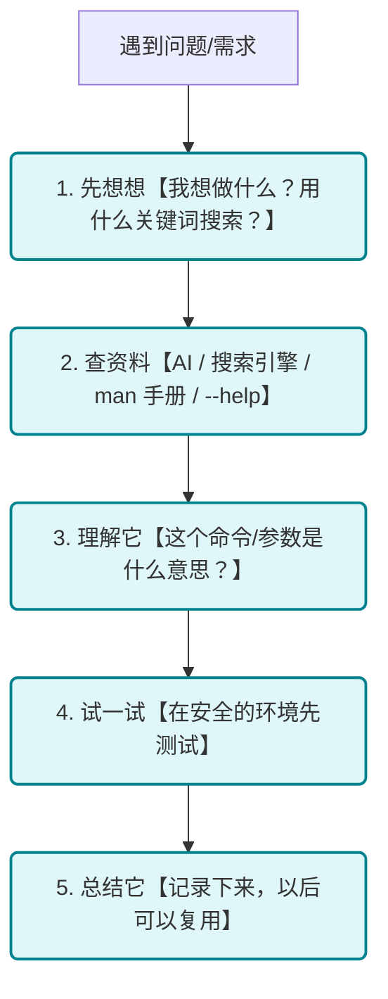

# 第 7 章：AI 辅助与自主探索

::: tip 本章目标
学会利用 AI 工具、官方文档和社区资源自主探索命令行世界。成为一个能够独立解决问题、不断进步的命令行老手！
:::

## 一、 🤖 AI：你的命令行助手

在 AI 时代，学习命令行变得前所未有的简单。AI 可以帮你：

- **生成命令**：告诉 AI 你想做什么，它帮你写命令
- **解释命令**：看不懂一条命令？让 AI 解释
- **排查错误**：遇到报错？让 AI 帮你分析
- **学习新知识**：对某个概念困惑？让 AI 讲解

### 1.1. 如何向 AI 请教命令行问题

#### 1.1.1. 请求生成命令

**好的提问方式：**
> 我想在 Linux 上找出当前目录下所有超过 100MB 的文件，并按大小排序显示

AI 可能会给你：
```bash
find . -type f -size +100M -exec ls -lh {} \; | sort -k5 -h
```

**更好的提问方式：**
> 我想在 Linux 上找出当前目录下所有超过 100MB 的文件，并按大小排序显示。请解释命令的每个部分。

AI 不仅会给你命令，还会解释：
- `find .` - 在当前目录搜索
- `-type f` - 只找文件（不包括目录）
- `-size +100M` - 大小超过 100MB
- `-exec ls -lh {} \;` - 对每个结果执行 ls 显示详情
- `sort -k5 -h` - 按第 5 列（大小）人性化排序

#### 1.1.2. 请求解释命令

当你遇到一条看不懂的命令：
```bash
tar -czvf backup.tar.gz --exclude='*.log' /var/www
```

可以这样问 AI：
> 请解释这条命令的作用和每个参数的含义

#### 1.1.3. 请求排查错误

当遇到错误信息：
```
bash: npm: command not found
```

可以这样问 AI：
> 我在 Linux 上运行 npm 时提示 "command not found"，我已经安装了 Node.js，可能是什么原因？如何解决？

### 1.2. AI 辅助的注意事项

::: warning AI 不是万能的
1. **验证 AI 的答案** —— AI 可能会给出过时或错误的信息
2. **理解后再执行** —— 不要盲目复制粘贴，特别是涉及删除、修改系统的命令
3. **注意安全** —— 不要让 AI 生成的命令直接操作敏感数据
4. **学习而非依赖** —— AI 是工具，不是拐杖。用它来学习，而不是替代学习
:::

### 1.3. 实用的 AI 提问模板

**学习新命令：**
> 请介绍 Linux 的 `grep` 命令，包括：
> 1. 基本功能
> 2. 常用参数
> 3. 5 个实用示例
> 4. 常见使用场景

**解决特定问题：**
> 在 Windows PowerShell 中，我想要：
> - 找出所有 .log 文件
> - 筛选出包含 "error" 的行
> - 按时间排序输出到新文件
>
> 请给出命令并解释

**对比学习：**
> 请对比 Linux 和 Windows 中查找文件的命令，包括：
> - Linux 的 find 命令
> - Windows CMD 的 dir /s
> - PowerShell 的 Get-ChildItem
>
> 用表格展示它们的常用参数对照

## 二、 📖 官方文档：最权威的参考

AI 很方便，但官方文档永远是最权威的信息来源。

### 2.1. man 手册（Linux/Mac）

`man` 是 Unix/Linux 系统自带的手册系统：

```bash
man ls        # 查看 ls 命令的手册
man -k copy   # 搜索包含 "copy" 的手册
```

**man 手册的结构：**

| 章节 | 内容 |
|------|------|
| NAME | 命令名称和简介 |
| SYNOPSIS | 语法格式 |
| DESCRIPTION | 详细描述 |
| OPTIONS | 可用选项 |
| EXAMPLES | 使用示例 |
| SEE ALSO | 相关命令 |

::: tip 阅读 man 手册的技巧
- 先看 DESCRIPTION 了解命令功能
- 再看 EXAMPLES 看实际用法
- 需要时再查 OPTIONS 了解具体参数
- 用 `/关键词` 在手册中搜索
:::

### 2.2. --help 选项

几乎所有命令都支持 `--help` 选项：

```bash
ls --help
git --help
docker --help
```

这比 man 手册更简洁，适合快速查阅。

### 2.3. 在线文档

| 工具 | 官方文档 |
|------|---------|
| **Bash** | [GNU Bash 手册](https://www.gnu.org/software/bash/manual/) |
| **PowerShell** | [Microsoft 文档](https://docs.microsoft.com/powershell/) |
| **Git** | [Git 文档](https://git-scm.com/doc) |
| **Docker** | [Docker 文档](https://docs.docker.com/) |

### 2.4. 速查网站

- **[tldr.sh](https://tldr.sh/)** —— 「太长不读」版的 man 手册，简洁实用
- **[explainshell.com](https://explainshell.com/)** —— 输入命令，逐字解释
- **[cheat.sh](https://cheat.sh/)** —— 命令速查表，支持 curl 访问

```bash
# 在终端直接查询
curl cheat.sh/tar
curl cheat.sh/git-rebase
```

## 三、 🔍 自主探索的能力

真正的命令行高手不是记住所有命令的人，而是知道如何**快速找到并学会**自己需要的命令的人。

### 3.1. 探索的方法论



### 3.2. 安全地探索

::: caution 探索时的安全原则
1. **不确定的命令先查再用** —— 特别是 `rm`、`dd`、`chmod` 等
2. **重要操作先备份** —— 修改配置文件前复制一份
3. **使用测试环境** —— 创建一个临时目录来试验
4. **读懂再执行** —— 不要盲目复制网上的命令
:::

### 3.3. 建立自己的知识库

随着学习的深入，你会积累越来越多的命令和技巧。建议：

1. **创建速查笔记** —— 记录常用命令和自己踩过的坑
2. **保存有用的脚本** —— 创建一个脚本仓库
3. **设置命令别名** —— 把复杂的常用命令简化

```bash
# 在 ~/.bashrc 或 ~/.zshrc 中添加常用别名
alias ll='ls -la'
alias ..='cd ..'
alias gs='git status'
alias gc='git commit'
alias gp='git push'

# 复杂命令的别名
alias findlarge='find . -type f -size +100M'
alias duh='du -h --max-depth=1 | sort -h'
```

## 四、 🌐 社区资源

### 4.1. Stack Overflow

[Stack Overflow](https://stackoverflow.com/) 是程序员的问答圣地。搜索命令行问题时，加上相关标签：

> `[bash] how to find files modified in last 24 hours`

### 4.2. GitHub

很多优秀的命令行工具和配置都在 GitHub 上开源：

- **[awesome-shell](https://github.com/alebcay/awesome-shell)** —— Shell 资源大全
- **[dotfiles](https://dotfiles.github.io/)** —— 配置文件分享
- **[awesome-cli-apps](https://github.com/agarrharr/awesome-cli-apps)** —— 命令行应用推荐

### 4.3. Reddit / 论坛

- **[r/commandline](https://www.reddit.com/r/commandline/)** —— 命令行相关讨论
- **[r/bash](https://www.reddit.com/r/bash/)** —— Bash 脚本讨论
- **[r/PowerShell](https://www.reddit.com/r/PowerShell/)** —— PowerShell 讨论

## 五、 🎯 从新手到老手的路径

### 5.1. 第一阶段：能用（你现在在这里！）

- ✅ 能打开终端
- ✅ 知道基本命令（cd、ls、mkdir 等）
- ✅ 能完成简单的文件操作
- ✅ 知道如何获取帮助

### 5.2. 第二阶段：熟练

- 能不假思索地使用常用命令
- 熟练使用 Tab 补全和历史命令
- 能编写简单的脚本自动化任务
- 理解管道和重定向

### 5.3. 第三阶段：高效

- 有一套自己的配置和别名
- 能快速排查和解决问题
- 熟悉多种 Shell 和工具
- 能编写复杂的自动化脚本

### 5.4. 第四阶段：精通

- 深入理解 Shell 的工作原理
- 能优化和调试复杂脚本
- 为开源项目贡献代码
- 能教授他人

::: tip 进步的秘诀
没有捷径，只有**多用多练**。

- 日常操作尽量用命令行完成
- 遇到重复任务就写成脚本
- 看到有趣的命令就试一试
- 定期学习新的工具和技巧
:::

## 六、 📚 推荐学习资源

### 6.1. 书籍

| 书名 | 适合人群 |
|------|---------|
| 《鸟哥的 Linux 私房菜》 | Linux 入门经典 |
| 《Linux 命令行大全》 | 系统学习命令行 |
| 《Shell 脚本学习指南》 | 深入学习脚本编程 |
| 《PowerShell 实战》 | Windows 自动化 |

### 6.2. 在线课程

- **[Linux Journey](https://linuxjourney.com/)** —— 免费的 Linux 学习网站
- **[Codecademy: Learn the Command Line](https://www.codecademy.com/learn/learn-the-command-line)** —— 交互式学习

### 6.3. 练习平台

- **[OverTheWire: Bandit](https://overthewire.org/wargames/bandit/)** —— 通过 CTF 游戏学习命令行
- **[cmdchallenge.com](https://cmdchallenge.com/)** —— 命令行挑战题

## 七、 🎊 恭喜你完成学习！

如果你已经学完了前面所有章节，恭喜你！你现在已经：

- ✅ 理解了命令行的本质和价值
- ✅ 掌握了基本的文件系统操作
- ✅ 了解了不同 Shell 的特点
- ✅ 搞懂了环境变量和 PATH
- ✅ 入门了脚本编程
- ✅ 学会了自主探索的方法

::: important 最后的建议
1. **不要追求记住所有命令** —— 知道如何查找比死记硬背更重要
2. **动手实践是王道** —— 光看不练是学不会的
3. **遇到问题是好事** —— 每解决一个问题，你就成长一点
4. **善用 AI 辅助** —— 但要理解后再用，不要盲目依赖
5. **保持好奇心** —— 命令行的世界很大，总有新东西可以学
:::

## 八、 📝 本章小结

1. **AI 是好帮手** —— 生成命令、解释命令、排查错误，但要验证后再用
2. **官方文档最权威** —— man、--help、官网文档是最可靠的信息源
3. **自主探索是关键** —— 想 → 查 → 理解 → 试 → 总结
4. **建立知识库** —— 笔记、脚本、别名，积累自己的「武器库」
5. **社区资源丰富** —— Stack Overflow、GitHub、Reddit

## 九、 🚀 接下来做什么？

完成本教程后，你可以：

1. **继续深入学习**
   - 学习更多高级命令（awk、sed、grep 进阶）
   - 深入 Shell 脚本编程
   - 学习 Linux 系统管理

2. **应用到实践中**
   - 用命令行进行日常文件管理
   - 为你的项目编写自动化脚本
   - 尝试配置你自己的开发环境

3. **探索相关领域**
   - 学习 Git 版本控制
   - 了解 Docker 容器技术
   - 尝试远程服务器管理（SSH）

::: note 结语
命令行不仅仅是一个工具，它是一种与计算机交流的方式，一种思考问题的方法。

当你能够熟练地在命令行中工作时，你会发现自己看待计算机的方式变了——它不再是一个神秘的黑盒子，而是一个可以被你精确控制的强大工具。

祝你在命令行的世界中探索愉快！🎉
:::

---

**返回：[命令行基础教程首页](./README.md)**
